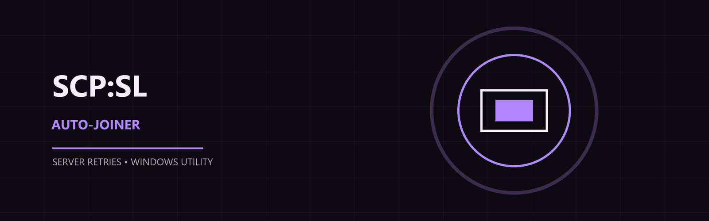
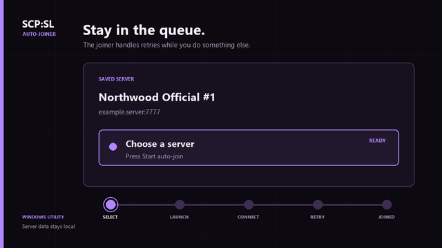

# SCP:SL Auto-Joiner

A Windows utility that keeps trying to join a configured SCP: Secret Laboratory server until a slot opens.





[Open the full-size MP4 demo](assets/generated/auto-join-demo.mp4)

## Download

Download the latest Windows build from the [Releases page](https://github.com/masternazz/scpsl-auto-joiner/releases). Choose the portable ZIP or the setup installer.

The portable ZIP runs from any folder. The setup installer creates a per-user installation and optional shortcuts. Neither package installs SCP: Secret Laboratory, Steam, or any third-party game files.

> **Early release notice:** This is an early Windows build and has not been tested on every SCP:SL server, monitor resolution, DPI setting, or Windows configuration. Please back up your local data, expect bugs, and [report issues on GitHub](https://github.com/masternazz/scpsl-auto-joiner/issues) with your Windows version, display setup, reproduction steps, and the app log.

## What it does

- Remembers server names and endpoints in a local server list
- Organizes saved servers into ordered local groups for retrying
- Detects the endpoint from SCP:SL’s `Player.log` when you join normally
- Looks up a friendly server name through the server’s normal query response
- Launches SCP:SL when it is closed
- Opens Direct Connect and submits the saved endpoint
- Detects accepted, rejected, full, cancelled, and timed-out attempts from `Player.log`
- Retries rejected or full servers using the configured delay
- Runs with no attempt or runtime limit when either limit is set to `0`
- Supports automatic resolution-relative controls and optional per-computer calibration
- Lets you delete saved servers and stop a running join at any time
- Imports SCP:SL translation packs from dragged folders, ZIP files, GitHub links, or local paths
- Searches GitHub dynamically for community translation repositories
- Keeps multiple packs installed and lets you switch one active custom pack on or off

## Requirements

- 64-bit Windows 10 version 1809 (build 17763) or later, or Windows 11
- SCP: Secret Laboratory installed through Steam
- Permission to join the selected server
- Borderless or windowed SCP:SL is recommended for the most reliable background interaction

The app does not use OCR, read game memory, inject into the game, manipulate packets, or bypass anti-cheat. It uses Steam launch parameters, targeted Windows input, and SCP:SL’s own log file.

## Quick start

1. Start the app and review the first-run local checks. They do not launch the game or capture the mouse.
2. Open **Servers**, then choose **Remember a server**.
3. Join the target server normally in SCP:SL.
4. When the app detects the endpoint, give it a friendly name and save it.
5. Select the saved server or an ordered group and choose **Start auto-join**.

The app can launch SCP:SL automatically. On the first run, open **Calibration** if automatic controls do not match your game layout. Move the pointer over each named control and capture it without clicking the game. Calibration is stored per computer and should be repeated after changing display scaling, resolution, or the game window layout.

The app checks the public GitHub Releases endpoint in the background at startup. If a newer release exists, it asks whether to install it. Enable **Install updates automatically** in Settings to approve verified releases without another prompt. The app downloads only GitHub-hosted assets, verifies their SHA-256 digest, installs the update, and restarts itself. A failed or offline check does not block the app.

## Settings

The app exposes these controls:

- **Connection method**: Automatic temporary-foreground GUI actions are recommended; Background-only remains available as a hands-off compatibility option
- **Navigation mode**: Use automatic resolution-relative controls or saved calibration
- **Group looping**: Restart ordered groups after the final server, or stop after one pass
- **Server refresh timeout**: Set the local A2S_INFO status-refresh timeout
- **Retry delay**: Seconds between rejected attempts; `2` is the default
- **Connection timeout**: Maximum time allowed for one attempt
- **Maximum attempts**: Stop after this many attempts; `0` means unlimited
- **Maximum runtime**: Stop after this many minutes; `0` means unlimited
- **Notifications**: Save the Windows-notification preference
- **Accent color**: Choose violet, cyan, amber, green, or red for the interface
- **Local storage**: Open, export, or reset local settings, saved servers, groups, and calibration

When both limits are `0`, auto-join continues until the server accepts the connection or you press **Stop**.

## Text Packs

Open **Text Packs** to drag in a translation folder or ZIP, choose one from a file picker, paste a GitHub repository/release link, or search GitHub for SCP:SL translation repositories. The app looks for `manifest.json` and translation `.txt` files, supports ZIPs with an extra outer folder, and installs packs in SCP:SL's `Translations` folder.

Multiple packs can remain installed, but SCP:SL uses one selected language at a time. Use **Activate** to mark a custom pack as active, or **Default** to switch the app back to the built-in language. Replacing a pack managed by the app creates a backup first; unmanaged built-in language folders are preserved. The app never executes imported pack contents.

Windows 10 is a supported target; the installer refuses older Windows versions so the packaged Qt runtime is not deployed onto an unsupported system. Windows notifications use the native toast path when available, with the in-app live feed as a fallback.

## How results are detected

SCP:SL writes connection events to `Player.log`. The app watches new log entries and classifies each attempt as connecting, accepted, rejected, cancelled, full, or timed out. This keeps join-state detection independent of monitor resolution.

The app sends input to SCP:SL only during short GUI actions, then restores your previous window and cursor. Automatic briefly foregrounds the game for reliable Unity input and returns control to you while it waits. Background-only never moves the cursor but may be ignored by SCP:SL.

## Local data

The app stores its data in:

```text
%LOCALAPPDATA%\SCP-SL-Auto-Joiner
```

This folder contains saved servers, settings, calibration, and error logs. Use **Open data folder** in the app to inspect it.

SCP:SL’s log remains in its normal location:

```text
%USERPROFILE%\AppData\LocalLow\Northwood\SCPSL\Player.log
```

## Troubleshooting

### The app cannot detect a server

Confirm that SCP:SL has written a connection attempt to `Player.log`, then start **Remember a server** before joining. You can also add a server manually if you already know its host and port.

### A retry misses a control

Use **Calibration**, capture the requested controls in order, and switch Settings to **Use saved calibration**. Borderless or windowed mode gives the automation a stable game window.

### The game opens when it is already running

The app uses the supported direct-connect launch path for a cold start. Close duplicate SCP:SL processes, then start the join again with one game window open.

### The app stops too soon

Set **Maximum attempts** and **Maximum runtime** to `0` for unlimited operation. Set **Retry delay** to `2` for the normal full-server retry interval.

## Build and test

Install Python 3.13, then run:

```powershell
py -3.13 -m pip install -r requirements.txt
py -3.13 -m pytest -q
./build_release.ps1
```

`build_release.ps1` creates the portable executable folder and ZIP. Install [Inno Setup](https://jrsoftware.org/isinfo.php), then run the script again to also create the setup installer. The packaged executable is created at `dist\SCP-SL-Auto-Joiner\SCP-SL-Auto-Joiner.exe`.

The repository also includes the source renderer for the README walkthrough at `assets\brand\render_demo.py`.

## Project documentation

- [Design specification](docs/superpowers/specs/2026-08-24-scpsl-autojoin-design.md)
- [Implementation plan](docs/superpowers/plans/2026-08-24-scpsl-autojoin.md)
- [Server name resolution research](docs/research/server-name-resolution.md)
- [SCP:SL client and server browser research](docs/research/scpsl-client-server-browser.md)
- [Background automation research](docs/background-automation-research.md)
- [Security review](docs/security-review.md)
- [Saved servers and groups](docs/server-groups.md)
- [Known WebView2 startup/bridge issue](docs/known-issue-webview-startup.md)

## License

No license has been selected yet. Until the repository gains a license, all rights remain with the copyright holder.
