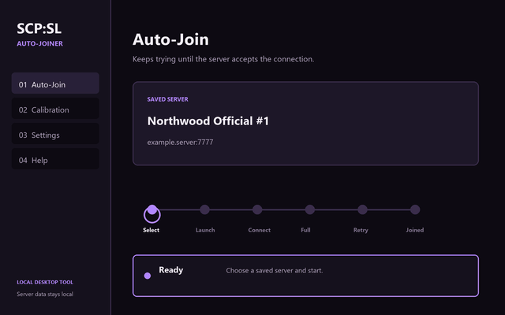

# SCP:SL Auto-Joiner

Windows helper for retrying SCP: Secret Laboratory server joins.




## Download

Get the latest Windows build from [Releases](https://github.com/masternazz/scpsl-auto-joiner/releases). Extract the ZIP and run `SCP-SL-Auto-Joiner.exe`.

## Use

1. Start the app.
2. Add a server, or select one you have already saved.
3. Press **Start auto-join**.

The app looks up a server's display name when it can, saves the endpoint locally, and retries a full or rejected server after the delay in Settings. Set attempts or runtime to `0` to keep trying until you stop it.

Automatic navigation scales to the current SCP:SL window. Calibration is available for unusual layouts or display setups. The game can be left running while the app waits.

## Data and input

Settings and saved servers are stored in the user's AppData folder. Join results are read from SCP:SL's `Player.log`. The normal path does not use OCR, memory reading, or game injection.

Most controls are sent to the game window. Some SCP:SL Unity builds ignore background input; in that case the app briefly uses a compatibility click and restores the previous foreground window and cursor position.

## Build and test

```powershell
py -3.13 -m pip install -r requirements.txt
py -3.13 -m pytest -q
./build_exe.ps1
```

This is a small personal utility for Windows, Steam, and SCP:SL.
