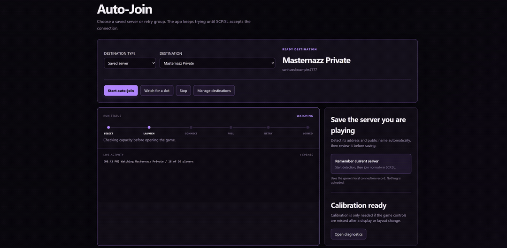
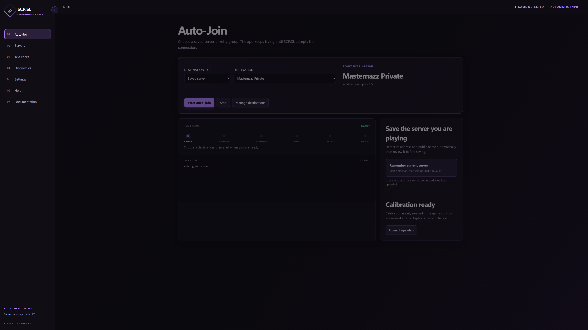
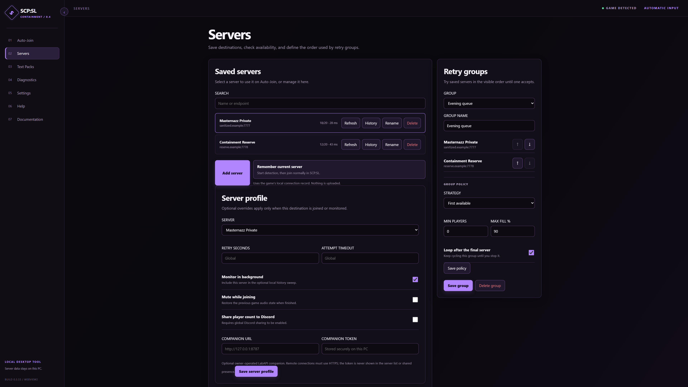
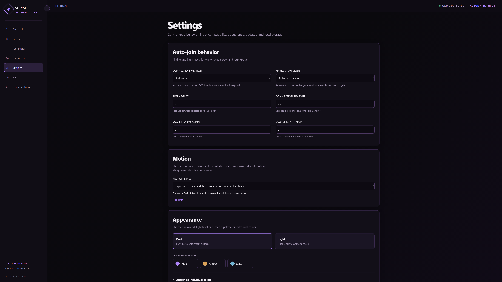
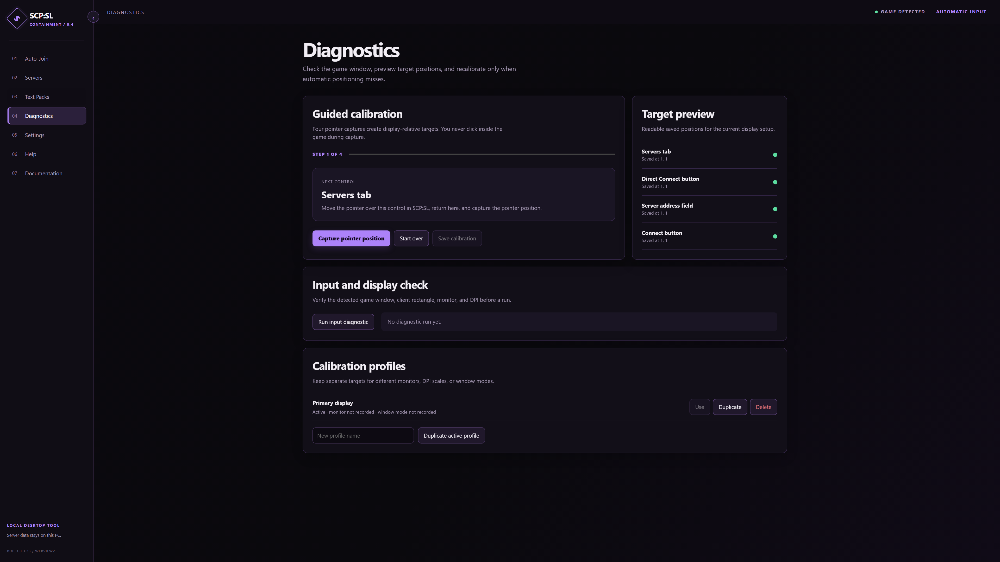
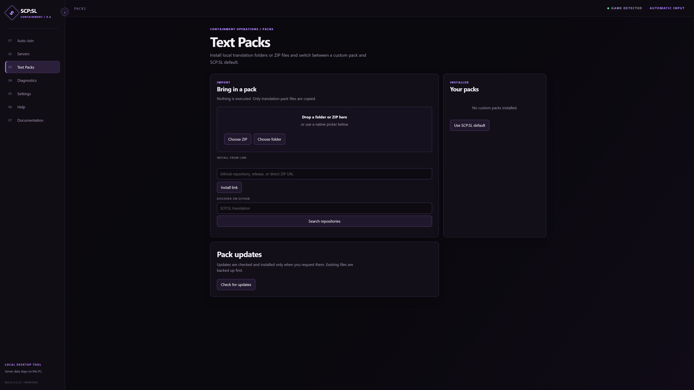

<p align="center">
  
</p>

<p align="center">
  A local Windows tool for watching saved SCP: Secret Laboratory servers, then joining when you are ready to try.
</p>

<p align="center">
  <a href="https://github.com/masternazz/scpsl-auto-joiner/releases/latest"><strong>Download for Windows</strong></a>
  &nbsp;|&nbsp;
  <a href="docs/roadmap-status.md">Feature status</a>
  &nbsp;|&nbsp;
  <a href="https://github.com/masternazz/scpsl-auto-joiner/issues">Report an issue</a>
</p>

<p align="center">
  
</p>

<p align="center">
  <a href="assets/generated/demo-webview.mp4">View the 1080p app walkthrough</a>
  &nbsp;|&nbsp;
  <a href="docs/readme-visuals.md">Recreate these visuals</a>
</p>

## In one minute

1. Download either the **setup installer** or the **portable ZIP** from [Releases](https://github.com/masternazz/scpsl-auto-joiner/releases/latest).
2. Open **Servers** and add an address, or use **Remember current server** before joining normally in SCP:SL. The app reads the next local connection entry and lets you review the detected server before saving it.
3. In **Auto-Join**, select a saved server or a retry group.
4. Choose **Watch for a slot** for the recommended no-input workflow, or **Start auto-join** when you want it to start the Direct Connect flow immediately.

Watch Mode checks the saved server first. It does not touch SCP:SL until capacity is detected and confirmed. Immediate Auto-Join remains available for the normal retry flow.

## What is new in v0.3.33

- **Watch Mode** waits for an available slot before interacting with SCP:SL.
- **Server history and insights** retain local availability, player-count, and latency observations.
- **Smart retry groups** can retry in order, choose the first available server, or prefer lower latency with population limits.
- **Destination bundles** provide previewed, privacy-limited server and group sharing.
- **Discord Rich Presence** is optional and off by default; each server must be explicitly shared before its name or a Join request is visible.
- **Calibration profiles** keep separate client-relative targets for different display setups.
- **Translation packs** support local folders, ZIP files, links, GitHub discovery, backups, and user-requested update checks.
- **Owned-server companion support** is separate, opt-in, and intended for servers you own or are authorized to manage.

## How it works

The app uses three narrow, visible mechanisms rather than hidden game modification:

| Mechanism | Used for | Not used for |
| --- | --- | --- |
| A2S server queries | Saved-server name, availability, player count, and latency | A public Internet server browser or player roles |
| Local SCP:SL connection record | Remembering the next server you join normally | Uploading your connection history |
| Short GUI interaction | Immediate Auto-Join after you choose it, or Watch Mode after a confirmed slot | Injection, OCR, memory access, or packet manipulation |

The activity log and retry timeline show what the app thinks happened: watching, slot candidate, connecting, full or rejected, retrying, joined, or an unclear result that needs diagnostics.

## Features

<table>
  <tr>
    <td width="50%" valign="top">
      
      <strong>Watch or join</strong><br>
      Select a saved destination or group, watch quietly for capacity, or start the immediate retry flow.
    </td>
    <td width="50%" valign="top">
      
      <strong>Saved servers and smart groups</strong><br>
      Refresh status, keep a local history, remember a server you are already playing, and use ordered or filtered groups.
    </td>
  </tr>
  <tr>
    <td width="50%" valign="top">
      
      <strong>Appearance that stays yours</strong><br>
      Choose light or dark mode, use curated palettes, change colors, or apply sanitized local CSS styling.
    </td>
    <td width="50%" valign="top">
      
      <strong>Calibration and diagnostics</strong><br>
      Keep client-relative profiles, inspect target previews, and create a useful bug report when a game update or display change causes trouble.
    </td>
  </tr>
  <tr>
    <td width="50%" valign="top">
      
      <strong>Text Packs</strong><br>
      Import translation folders or ZIP files, discover GitHub packs, select one active custom pack, and restore backups.
    </td>
    <td width="50%" valign="top">
      <strong>Local controls</strong><br>
      Use notification-area controls while active, optionally mute game audio during a run, and keep settings, reports, and history on this PC.
      <br><br>
      <strong>Optional integrations</strong><br>
      Destination sharing, Discord presence, background monitoring, and the owned-server companion are deliberately opt-in.
    </td>
  </tr>
</table>

## Privacy and safety

- The application is local-first. Saved servers, groups, history, settings, calibration profiles, themes, text-pack records, and bug reports remain in local AppData.
- It does not use injection, OCR, memory inspection, packet manipulation, or a hosted application backend.
- Discord presence is disabled by default. A visible server name or Join request requires per-server permission; a player count additionally requires the global player-count setting. Raw endpoints are not shown in Discord text, and Discord Join opens an import preview instead of joining automatically.
- Destination bundles exclude passwords, tokens, local IDs, calibration, history, themes, and other local settings. Every import has a preview before it is saved or joined.
- The optional LabAPI companion is for owned or authorized servers only. It is a separate plugin, never installed automatically, and public-server role detection is not a feature of this app.

See [the security review](docs/security-review.md), [destination sharing notes](docs/roadmap-status.md), the [Discord Rich Presence guide](docs/discord-rich-presence.md), and the [owned-server companion guide](docs/owned-server-companion.md) for details.

## Requirements and limitations

- Windows 10 or Windows 11 with Steam and SCP: Secret Laboratory installed.
- A saved server must answer A2S queries for Watch Mode and status to be useful. Query responses are advisory; a one-slot result is confirmed before Watch Mode acts.
- SCP:SL/Unity window behavior can change across game updates, monitor layouts, DPI scales, and window modes. Automatic geometry is preferred; use Diagnostics and a calibration profile when it misses.
- Immediate Auto-Join can briefly focus SCP:SL only when it must interact with its UI. Watch Mode does no game input until an eligible slot is confirmed.
- A public global server browser requires access that this project does not use. The browser here is for saved destinations.
- This project cannot reliably detect a role on public servers. Role and round data require the optional owned-server companion.
- Windows packages are unsigned. Verify the release checksum before running a downloaded build; see [the security review](docs/security-review.md).

## Troubleshooting

| Problem | First thing to check |
| --- | --- |
| A remembered server is not found | Start **Remember current server**, then join normally once in SCP:SL. Review the detected address and queried name before saving. |
| Watch Mode cannot find capacity | Refresh the saved server. If queries fail repeatedly, leave Watch Mode running or use Immediate Auto-Join as the fallback. Some servers do not expose usable query data. |
| The game UI is missed | Open **Diagnostics**, verify the detected client rectangle, monitor, and DPI, then recalibrate or choose the matching profile. |
| Retries stop or look unclear | Read the Live Activity message. Include it, your SCP:SL version, resolution, DPI scale, and window mode in a generated bug report. |
| An update fails | Restart the app, confirm that the previous version still opens, and download the current installer or portable ZIP from Releases. Your local AppData data is preserved across normal updates. |

## For contributors

The project is a Python backend with a local WebView UI. Start with the
[documentation index](docs/index.md) and [maintainer handoff](docs/handoff.md),
then read [development](docs/development.md), [architecture](docs/architecture.md),
[product design](docs/product-design.md), and [release status](docs/roadmap-status.md)
before changing behavior.

```powershell
# Install all development, UI-test, capture, and packaging dependencies.
py -3.13 -m pip install -r requirements-dev.txt
py -3.13 -m playwright install chromium

# Run the main test suite.
py -3.13 -m pytest tests --ignore=tests/test_gui_flow.py -q

# Run legacy Qt flow tests separately (they use a different Qt process setup).
py -3.13 -m pytest tests/test_gui_flow.py -q

# Build a versioned portable ZIP and, when Inno Setup is installed, the setup installer.
.\build_release.ps1 -Version 0.3.33

# Regenerate the public README visuals with fictional data only.
py -3.13 assets\brand\render_readme_assets.py
```

The [visual maintenance guide](docs/readme-visuals.md) explains the reproducible demo and screenshot workflow. Release notes live in [`docs/`](docs/), and every release should preserve the user data in AppData.

## License and affiliation

This is an independent community tool and is not affiliated with Northwood Studios, Steam, Valve, or Discord. SCP: Secret Laboratory and related marks belong to their respective owners. See [LICENSE.txt](LICENSE.txt).
